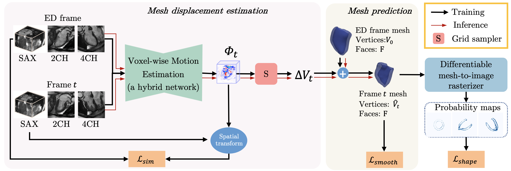

# Mesh-based-cardiac-motion-tracking
Code for paper ''Mesh-based 3D Motion Tracking in Cardiac MRI using Deep Learning' 

<p align="center">
    
</p>

# Citation and Acknowledgement

If you make use of the code, or if you found the code useful, please cite the paper in any resulting publications.
```
@InProceedings{Meng2022MeshMotion,
title = {Mesh-based 3D Motion Tracking in Cardiac MRI using Deep Learning},
booktitle = {MICCAI},
year = {2022},
author = {Qingjie Meng and Wenjia Bai and Tianrui Liu and Declan P O'Regan and Daniel Rueckert},
}
```
